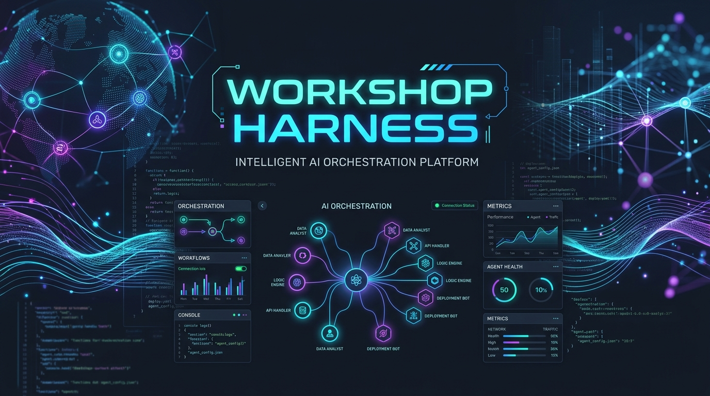

# Workshop Harness (中文)

[](https://JAICHANGPARK.github.io/workshop-harness/)
[](https://JAICHANGPARK.github.io/workshop-harness/website/)
[](https://opensource.org/licenses/MIT)
[](https://astral.sh/uv)
[](https://www.python.org/downloads/)
[](https://github.com/JAICHANGPARK)
[](https://github.com/JAICHANGPARK/workshop-harness/releases)

Languages: [English](./README.md) | [Korean](./README_KR.md) | [Japanese](./README_JA.md) | [Chinese](./README_ZH.md)

**官方文档**: [https://JAICHANGPARK.github.io/workshop-harness/](https://JAICHANGPARK.github.io/workshop-harness/)  
**介绍主页**: [https://JAICHANGPARK.github.io/workshop-harness/website/](https://JAICHANGPARK.github.io/workshop-harness/website/)

---

## 项目概述

`workshop-harness` 是一个由 **Astral uv** 驱动的 AI Agent 编排框架、14 项技能套件与 CLI 自动化工具包，专为技术工作坊（Build with AI、DevFest 和社区开发者实验室）的组织者、讲师和助教打造。

遵循 [AGENTS.md 开放规范](https://agents.md/)，该工具包与 **Google Antigravity**、**Gemini CLI**、**Anthropic Claude Code**、**OpenAI Codex / ChatGPT**、**Cursor** 及 **Aider** 等所有主流 AI 编程 Agent 原生兼容。

---

## ⚡ 快速上手 (uv 驱动)

```bash
# 1. 克隆代码仓库
git clone https://github.com/JAICHANGPARK/workshop-harness.git
cd workshop-harness

# 2. 自动安装 14 项 Agent 技能至本地环境 (~/.gemini/skills/)
chmod +x scripts/install_skills.sh
./scripts/install_skills.sh

# 3. 一键生成完整工作坊物料包
uv run harness_cli.py generate-all --name "my-bwai-workshop" --topic "Local RAG with Gemma 4" --stack "python,ollama,docker"
```

---

## 🧩 全套 15 项 Agent 技能规范

| # | 技能名称 | 触发 / 输入 | 产出与制品 | 主要职责 |
|---|---|---|---|---|
| 1 | [`workshop-scaffolder`](skills/workshop-scaffolder/SKILL.md) | 工作坊名称与主题 | `docs/`, `workshop/`, `prompt-pack/`, `scripts/` | 自动脚手架生成标准工作坊仓库结构 |
| 2 | [`cross-architecture-checker`](skills/cross-architecture-checker/SKILL.md) | 技术栈清单 | `docs/00-architecture-compatibility-matrix.md` | 诊断 Apple Silicon, Intel Mac, Win, Linux 的架构兼容性与替代方案 |
| 3 | [`prerequisite-checker`](skills/prerequisite-checker/SKILL.md) | 准备工作清单 | `gemma4-local-setup-guide.md`, `check_env.sh/ps1` | 生成各 OS 预备指南及环境自动检测脚本 |
| 4 | [`hands-on-curriculum-builder`](skills/hands-on-curriculum-builder/SKILL.md) | 目标与时长 | `03_labs/README.md`, `prompt-pack/`, `starter`/`final` 代码 | 构建循序渐进 Lab 教程、骨架/参考代码与 Prompt 集合 |
| 5 | [`pdf-handout-generator`](skills/pdf-handout-generator/SKILL.md) | `docs/` Markdown 目录 | `output/pdf/*.pdf`, `tmp/pdfs/contact_sheet.png` | 基于 ReportLab 将文档合成为出版级高清 PDF 讲义与缩略图 |
| 6 | [`workshop-troubleshooter`](skills/workshop-troubleshooter/SKILL.md) | 硬件规格与 OS | `docs/troubleshooting.md`, `docs/20-faq.md` | 按内存规格 (8G/16G/32G) 与系统构建排错矩阵与 FAQ |
| 7 | [`workshop-runbook-generator`](skills/workshop-runbook-generator/SKILL.md) | 讲程时长与 TA 人数 | `RUNBOOK.md` | 生成讲师与助教专用的分秒级 Runbook 及演练提示卡 |
| 8 | [`live-debug-assistant`](skills/live-debug-assistant/SKILL.md) | 终端错误日志 | 10 秒热修复指令, `.env.sample` | 现场终端错误 10 秒快速诊断与 API Key 安全协议防泄漏 |
| 9 | [`workshop-faq-generator`](skills/workshop-faq-generator/SKILL.md) | 主题与难度 | `docs/20-faq.md` / `FAQ.md` | 自动生成参会者软硬件/网络/代码常见问题解答 |
| 10 | [`workshop-tester`](skills/workshop-tester/SKILL.md) | 项目路径 | `verify_workshop.py` 报告 | 代码运行烟雾测试与 Markdown 相对失效链接自动审计 |
| 11 | [`workshop-web-researcher`](skills/workshop-web-researcher/SKILL.md) | 工具/模型关键词 | 最新版本与更新说明 | 通过实时网络搜索核验最新 SDK 标签，防止过时指令 |
| 12 | [`workshop-persona-loop-evaluator`](skills/workshop-persona-loop-evaluator/SKILL.md) | 主题与材料 | `docs/00-persona-loop-review-report.md` | 基于循环工程从初级/中级/高级多角色画像进行审查 |
| 13 | [`open-codelabs-integrator`](skills/open-codelabs-integrator/SKILL.md) | 项目路径 | `output/open-codelabs/` (`codelab.yaml`), `oc` push | 转换为 Open Codelabs 平台格式并通过 `oc` CLI/MCP 发布 |
| 14 | [`colab-workshop-integrator`](skills/colab-workshop-integrator/SKILL.md) | 项目路径 | `output/colab/` (`*.ipynb`, 徽章), `colab` CLI 验证 | 转换生成 Google Colab 交互式笔记本、徽章并自动化 CLI 烟雾测试 |
| 15 | [`workshop-slide-generator`](skills/workshop-slide-generator/SKILL.md) | 项目路径 | `output/slides/` (`slides.md`, `index.html`), PDF | 自动生成 Marp Markdown 幻灯片与同演练手册同步的交互式网页演示 |

---

## 🛠️ CLI 使用说明 (`harness_cli.py`)

```bash
# 1. 一键触发全套 14 项技能生成
uv run harness_cli.py generate-all --name "my-bwai-workshop" --topic "Local RAG with Gemma 4" --stack "python,ollama,docker"

# 2. 导出 Google Colab 笔记本与 Open in Colab 徽章
uv run harness_cli.py export-colab --target my-bwai-workshop --repo "JAICHANGPARK/my-bwai-workshop"

# 3. 使用 Google Colab CLI 执行云端无头测试
uv run harness_cli.py test-colab --target my-bwai-workshop

# 4. 导出 Open Codelabs Bundle 并推送
uv run harness_cli.py export-codelab --target my-bwai-workshop --push

# 5. 跨架构硬件兼容性风险审计
uv run harness_cli.py audit-compat --stack "lmstudio,docker,mlx"

# 6. 构建 PDF 讲义
uv run harness_cli.py build-pdf --target my-bwai-workshop
```

---

## 开源协议

[MIT License](LICENSE)
