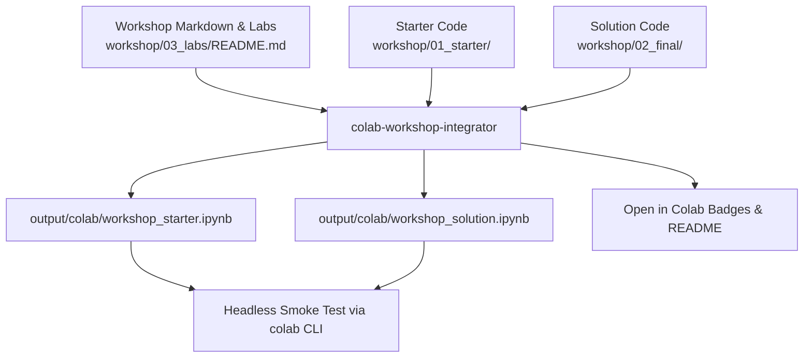

# Google Colab Integration (`colab-workshop-integrator`)

`workshop-harness` features complete bidirectional integration with **Google Colab** and the **Google Colab CLI** (`https://github.com/googlecolab/google-colab-cli`).

---

## 🎯 Overview & Utility

During technical workshops and hackathons, attendees frequently bring laptops with varying hardware architectures, restricted corporate environments, or lack local GPU capabilities. The `colab-workshop-integrator` skill automatically ports workshop documentation and lab codes into cloud-ready Jupyter Notebooks (`.ipynb`) with zero manual effort.



---

## 🚀 Key Features

### 1. Automatic Notebook Transformation
- Parses `workshop/03_labs/README.md` step headers (`## Lab 01`, `## Lab 02`) into cleanly formatted markdown cells.
- Generates both `workshop_starter.ipynb` (with `TODO` practice prompts) and `workshop_solution.ipynb` (complete facilitator reference).

### 2. Zero-Setup Runtime Preparation Cells
- **Auto Dependency Installation**: Injects `%pip install` commands at the top cell.
- **Hardware Acceleration Check**: Adds `!nvidia-smi` GPU detection.
- **Secure Secret Retrieval**: Injects `google.colab.userdata` API key handling so participants do not leak credentials in code cells.

### 3. 'Open in Colab' Badges
- Automatically generates SVG badges linking to the target GitHub repository:
  ```markdown
  [](https://colab.research.google.com/github/JAICHANGPARK/my-workshop/blob/main/output/colab/workshop_starter.ipynb)
  ```

### 4. Headless Testing with Google Colab CLI
- Automates smoke testing notebooks in a real cloud environment using `google-colab-cli`:
  ```bash
  python3 harness_cli.py test-colab --target my-bwai-workshop
  ```

---

## 🛠 Usage & CLI Commands

```bash
# Export Colab bundle
python3 harness_cli.py export-colab --target my-bwai-workshop

# Specify GitHub repo for badges
python3 harness_cli.py export-colab --target my-bwai-workshop --repo "JAICHANGPARK/my-bwai-workshop"

# Run smoke test via Google Colab CLI
python3 harness_cli.py test-colab --target my-bwai-workshop
```
