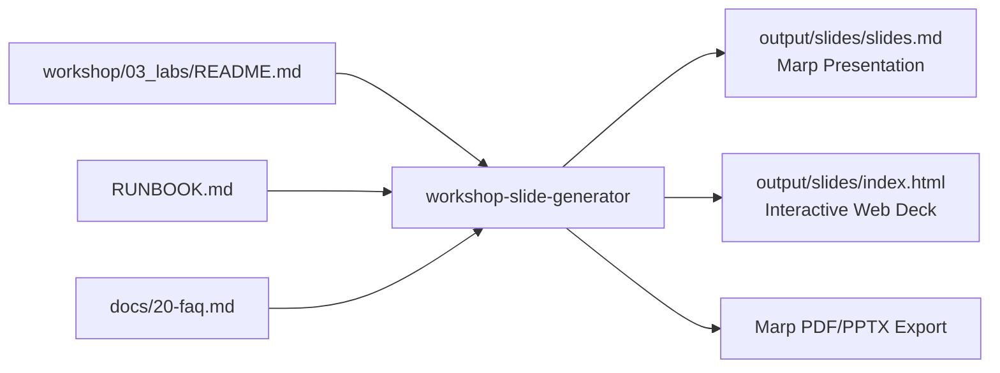

# Workshop Slide Generator (`workshop-slide-generator`)

`workshop-harness` features an automated presentation slide deck builder producing **Marp Markdown** (`slides.md`) and **zero-dependency interactive Web Presentations** (`index.html`).

---

## 🎯 Overview & Utility

Creating slide decks manually for each hands-on workshop is time-consuming and often falls out of sync with actual code changes or facilitator runbooks. The `workshop-slide-generator` skill parses your workshop repository structure and generates a ready-to-present slide deck matching `RUNBOOK.md` timeline markers in seconds.



---

## 🚀 Key Features

### 1. Google Slides (구글 프레젠테이션) 1-Click Import
- Native 16:9 widescreen `.pptx` built specifically for Google Slides.
- Go to Google Slides ➔ **File > Import slides** ➔ Upload `slides.pptx` ➔ 100% formatted Google Slides deck created instantly.
- Also generates a **Google Apps Script** (`create_google_slides.gs`) to programmatically build slides via Google Drive APIs.

### 2. Zero-Setup Web Presentation (`index.html`)
- Open `output/slides/index.html` in any browser (Chrome, Safari, Edge, Firefox).
- Keyboard shortcuts:
  - `Right Arrow` / `Space` ➔ Next Slide
  - `Left Arrow` ➔ Previous Slide
  - `F` ➔ Fullscreen toggle
  - `Home` / `End` ➔ First / Last Slide
- Includes dynamic progress bar, modern typography (Inter Display + JetBrains Mono), and dark mode.

### 3. Marp Markdown (`slides.md`)
- Ready for presentation using VS Code Marp extension or Marp CLI.
- Standard themes, custom scoped styles, and presenter speaker notes (`<!-- Speaker Notes: ... -->`).

### 4. Facilitator Runbook 1:1 Sync
- Automatically syncs agenda minutes and slide topics with `RUNBOOK.md` timestamps and `[Slide #X]` markers.

---

## 🛠 Usage & CLI Commands

```bash
# Build slide deck (Google Slides PPTX, Marp markdown, and Web presentation)
python3 harness_cli.py build-slides --target my-bwai-workshop

# Open web presentation in browser
open my-bwai-workshop/output/slides/index.html

# (Optional) Export to PDF via Marp CLI
npx @marp-team/marp-cli@latest my-bwai-workshop/output/slides/slides.md --pdf -o my-bwai-workshop/output/slides/slides.pdf
```
