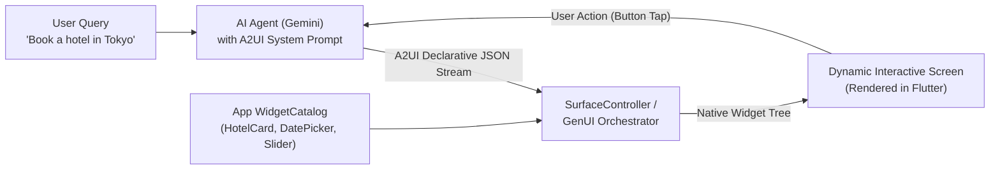
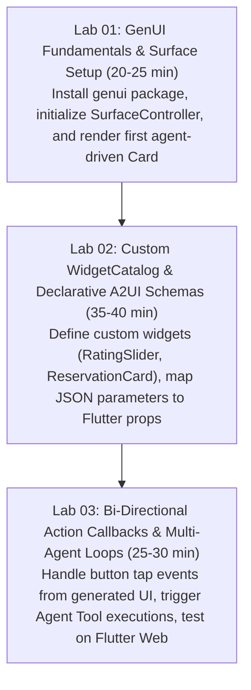

# A2UI & Flutter GenUI Workshop Builder Skill

## Purpose

Automates the creation of cutting-edge hands-on workshops focused on **A2UI (Agent-to-User Interface)** and **Generative UI (GenUI)** in Flutter. Teaches developers how to replace static, hardcoded application screens and monolithic markdown text responses with **agent-driven, dynamically orchestrated native UI widgets**.

> Protocol & SDK Standards:
> - **A2UI Protocol (`a2ui.org`)**: Open-source, framework-agnostic protocol where AI agents emit declarative JSON structures representing UI components.
> - **Flutter GenUI SDK (`genui`)**: Official Google Flutter framework providing `WidgetCatalog`, `SurfaceController`, and `GenUISurface` to render A2UI payloads natively.

---

## Core GenUI & A2UI Architectural Concepts



### 1. The A2UI Protocol Layer (`a2ui.org`)
- Agents generate structured UI specifications (e.g., component type, layout arrangement, styling tokens, and bound parameters) instead of plain text.
- Security-by-design: Agents cannot execute arbitrary JavaScript or unapproved bytecode; they can only reference components pre-registered in the client's `WidgetCatalog`.

### 2. WidgetCatalog & Component Registration
- The developer defines a catalog of allowed Flutter widgets.
- Each widget specifies its unique ID, JSON parameter schema, and a builder callback.

### 3. SurfaceController & Bi-Directional Action Loop
- `SurfaceController` parses the agent's incoming stream and incrementally mounts widgets on the screen.
- When an attendee clicks a generated button or submits a form, an action event payload is dispatched back to the agent as a tool response or follow-up prompt.

---

## Technical Stack & Dependencies

| Layer | Package | Purpose | File Location |
|---|---|---|---|
| **GenUI Core** | `genui` | Orchestration layer & SurfaceController | `pubspec.yaml` |
| **Pre-built Widgets** | `genui_catalog` | Ready-to-use Material 3 generative widgets | `pubspec.yaml` |
| **Agent Connector** | `genui_a2a` or `google_generative_ai` | Connects to Gemini or A2UI agent backend | `pubspec.yaml` |
| **Testing / Mocking** | `genui_mock` | Offline mocking of agent sessions for zero-network labs | `pubspec.yaml` |

---

## 3-Stage Hands-on Lab Curriculum



---

## Hands-on Implementation Snippet

```dart
// Flutter GenUI Widget Catalog & Surface Example
import 'package:flutter/material.dart';
import 'package:genui/genui.dart';

// 1. Define custom widget data model
class RecommendationCardData {
  final String title;
  final String description;
  final double rating;
  final String actionLabel;

  RecommendationCardData({
    required this.title,
    required this.description,
    required this.rating,
    required this.actionLabel,
  });

  factory RecommendationCardData.fromJson(Map<String, dynamic> json) {
    return RecommendationCardData(
      title: json['title'] as String? ?? 'Untitled',
      description: json['description'] as String? ?? '',
      rating: (json['rating'] as num?)?.toDouble() ?? 5.0,
      actionLabel: json['actionLabel'] as String? ?? 'Select',
    );
  }
}

// 2. Define Widget Catalog
final customCatalog = WidgetCatalog([
  CatalogItem(
    name: 'RecommendationCard',
    description: 'Displays a rich recommendation card with rating and an action button.',
    builder: (context, data, controller) {
      final item = RecommendationCardData.fromJson(data);
      return Card(
        margin: const EdgeInsets.symmetric(vertical: 8),
        child: Padding(
          padding: const EdgeInsets.all(16),
          child: Column(
            crossAxisAlignment: CrossAxisAlignment.start,
            children: [
              Text(item.title, style: Theme.of(context).textTheme.titleMedium),
              const SizedBox(height: 4),
              Text(item.description),
              const SizedBox(height: 8),
              Row(
                mainAxisAlignment: MainAxisAlignment.spaceBetween,
                children: [
                  Text('⭐ ${item.rating}'),
                  ElevatedButton(
                    onPressed: () {
                      controller.dispatchAction('card_selected', {'title': item.title});
                    },
                    child: Text(item.actionLabel),
                  ),
                ],
              ),
            ],
          ),
        ),
      );
    },
  ),
]);
```

---

## 🛠️ Flutter Agent Plugins & Package Skills Integration

Combine GenUI & A2UI development with official **Flutter Agent Plugins (`github.com/flutter/agent-plugins`)** and **Dart Package Skills (`docs.flutter.dev/ai/package-skills`)**:

1. **Package Skills Auto-Discovery**:
   - Run `dart run skills@ get` to auto-discover bundled AI skills from `genui` and third-party packages on `pub.dev`.
2. **Layout Resilience with `flutter-fix-layout-issues`**:
   - AI-generated dynamic widget trees are prone to unbounded height or RenderFlex overflow errors. Enforce `flutter-fix-layout-issues` and `flutter-build-responsive-layout` in the widget catalog builders.
3. **Dart & Flutter MCP Server**:
   - Use `hot_reload` and `widget_inspector` MCP tools to instantly preview streaming A2UI UI updates.

---

## Troubleshooting & Best Practices for A2UI Workshops

1. **Deterministic Schema Enforcement**:
   - Provide explicit system instructions or JSON schema to the Gemini model so it strictly outputs valid A2UI component names registered in `customCatalog`.
2. **Offline Fallback with `genui_mock`**:
   - In venues with unstable WiFi, use `genui_mock` recorded sessions to let attendees complete UI layout and interaction exercises without live API calls.
3. **Cross-Platform Delivery**:
   - Run via Flutter Web (`flutter run -d chrome`) for the fastest attendee onboarding without heavy emulator requirements.

