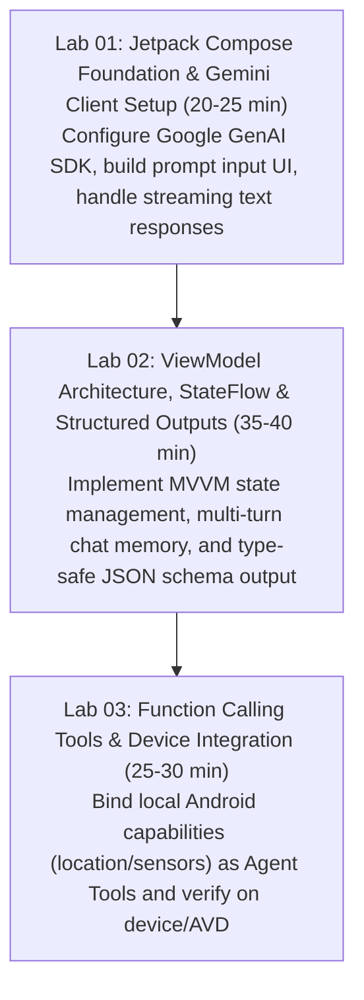

# Android Hands-on Workshop Builder Skill

## Purpose

Automates the creation of end-to-end technical hands-on workshops focused on **Android Generative AI** applications. Enforces modern Android development best practices including **Jetpack Compose (Material 3)**, **Gradle Kotlin DSL (`build.gradle.kts`)**, reactive state management with **ViewModel and StateFlow**, and the unified **Google GenAI Kotlin Android SDK (`com.google.genai`)**.

> Pre-Flight Web Research Protocol:
> Before generating Android workshop curriculum or code, verify the latest SDK versions for `com.google.genai:google-genai-kotlin-android` (modern unified SDK) and avoid legacy deprecated packages (`com.google.ai.client.generativeai`).

---

## Technical Stack & Dependency Matrix

| Layer | Component | Recommended Package / Version | File Location |
|---|---|---|---|
| **Language & Toolchain** | Kotlin | 2.0.0+ | `build.gradle.kts` |
| **Build System** | Android Gradle Plugin (AGP) | 8.5.0+ / 9.0.0+ | `build.gradle.kts` |
| **UI Framework** | Jetpack Compose BOM | 2024.09.00+ (Material 3) | `app/build.gradle.kts` |
| **GenAI SDK** | Google GenAI Kotlin | `com.google.genai:google-genai-kotlin-android:0.4.0` | `app/build.gradle.kts` |
| **Reactive State** | Android Lifecycle ViewModel | `androidx.lifecycle:lifecycle-viewmodel-compose:2.8.0` | `app/build.gradle.kts` |
| **Coroutines** | Kotlinx Coroutines Android | `org.jetbrains.kotlinx:kotlinx-coroutines-android:1.8.0` | `app/build.gradle.kts` |

---

## 3-Stage Hands-on Lab Curriculum



---

## Architectural Patterns for Android Workshops

### 1. Separation of Concerns (UI, ViewModel, AI Client)
- **UI Layer**: Pure `@Composable` functions taking immutable UI state and emitting UI events.
- **ViewModel Layer**: Manages `StateFlow<UiState>`, launches coroutines via `viewModelScope`, and handles AI client exceptions.
- **AI Service Layer**: Wraps `com.google.genai.Client` to isolate API key handling and request orchestration.

```kotlin
// Android GenAI ViewModel Example
package com.example.workshop

import androidx.lifecycle.ViewModel
import androidx.lifecycle.viewModelScope
import com.google.genai.Client
import kotlinx.coroutines.flow.MutableStateFlow
import kotlinx.coroutines.flow.StateFlow
import kotlinx.coroutines.flow.asStateFlow
import kotlinx.coroutines.launch

sealed interface ChatUiState {
    object Idle : ChatUiState
    object Loading : ChatUiState
    data class Success(val responseText: String) : ChatUiState
    data class Error(val message: String) : ChatUiState
}

class ChatViewModel : ViewModel() {
    private val _uiState = MutableStateFlow<ChatUiState>(ChatUiState.Idle)
    val uiState: StateFlow<ChatUiState> = _uiState.asStateFlow()

    private val aiClient = Client.builder()
        .apiKey(BuildConfig.GEMINI_API_KEY)
        .build()

    fun sendMessage(prompt: String) {
        viewModelScope.launch {
            _uiState.value = ChatUiState.Loading
            try {
                val response = aiClient.models.generateContent(
                    model = "gemini-3.7-flash",
                    prompt = prompt
                )
                _uiState.value = ChatUiState.Success(response.text ?: "No response")
            } catch (e: Exception) {
                _uiState.value = ChatUiState.Error(e.localizedMessage ?: "Unknown error")
            }
        }
    }
}
```

---

## Cross-Architecture & Attendee Environment Matrix

| Attendee Hardware | Recommended Setup | Potential Risk | Fallback Strategy |
|---|---|---|---|
| **Apple Silicon Mac (M1-M4)** | Android Studio + ARM64 AVD Image | Fast native virtualization | None needed (ideal setup) |
| **Intel Mac (x86_64)** | Android Studio + x86_64 AVD Image | High CPU throttling / fan noise | Connect physical Android device via USB debugging |
| **Windows 11 (AMD/Intel)** | Android Studio + Windows Hypervisor (AEHD) | Hyper-V or WSL2 conflicts | Enable AEHD driver or use USB debugging |
| **Linux (Ubuntu/Fedora)** | Android Studio + KVM Acceleration | Missing `/dev/kvm` user permissions | Run `sudo usermod -aG kvm $USER` and reboot |

---

## Facilitator Verification Checklist

1. Verify JDK 17 or JDK 21 is set as `JAVA_HOME` in Android Studio settings (`Settings > Build, Execution, Deployment > Build Tools > Gradle`).
2. Ensure `local.properties` or `gradle.properties` contains `GEMINI_API_KEY` without committing secrets to git.
3. Pre-download Android Gradle dependencies and Gradle wrapper distribution before the event to prevent workshop venue network bottlenecks.
