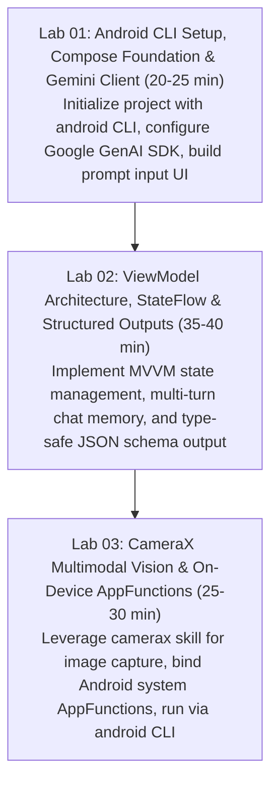

# Android Hands-on Workshop Builder Skill

## Purpose

Automates the creation of end-to-end technical hands-on workshops focused on **Android Generative AI** applications. Enforces modern Android development best practices including **Jetpack Compose (Material 3)**, **Gradle Kotlin DSL (`build.gradle.kts`)**, reactive state management with **ViewModel and StateFlow**, the unified **Google GenAI Kotlin Android SDK (`com.google.genai`)**, and Google's official **`android` CLI & Android Agent Skills**.

> Pre-Flight Web Research Protocol:
> Before generating Android workshop curriculum or code, verify the latest SDK versions for `com.google.genai:google-genai-kotlin-android` (modern unified SDK, avoiding legacy `com.google.ai.client.generativeai`) and confirm `android` CLI commands via `android docs` or official developer documentation.

---

## 🛠️ Google Android CLI & Skills Ecosystem Integration

Android hands-on workshops should actively utilize Google's **`android` CLI** and **Android Agent Skills** to streamline environment verification, headless emulator management, project scaffolding, and AI-assisted debugging:

### 1. `android` CLI Toolchain by OS

| Operating System & Architecture | Official One-Line Installation Command |
|---|---|
| **macOS Apple Silicon (`arm64`)** | `curl -fsSL https://dl.google.com/android/cli/latest/darwin_arm64/install.sh \| bash` |
| **macOS Intel (`x86_64`)** | `curl -fsSL https://dl.google.com/android/cli/latest/darwin_x86_64/install.sh \| bash` |
| **Linux (`x86_64`)** | `curl -fsSL https://dl.google.com/android/cli/latest/linux_x86_64/install.sh \| bash` |
| **Windows (`x86_64`)** | `curl -fsSL https://dl.google.com/android/cli/latest/windows_x86_64/install.cmd -o "%TEMP%\i.cmd" && "%TEMP%\i.cmd"` |

### 2. Essential `android` CLI Workflow for Workshops

```bash
# 1. Initialize Android CLI environment & agent skills for project
android init

# 2. Install all official Google Android Agent Skills
android skills add --all

# 3. Verify connected devices & SDK configuration
android info

# 4. Manage Android Virtual Devices (AVD) headlessly
android emulator list
android emulator start <avd-name>

# 5. Search official Android Knowledge Base & Best Practices
android docs "Google GenAI SDK Kotlin Compose"

# 6. Build and run app on active device / emulator
android run

# 7. Inspect UI layout tree in JSON (fast headless debugging for AI agents)
android layout
```

### 3. Official Android Agent Skills Integration Matrix

When authoring modular hands-on lab tracks, delegate specialized implementation patterns to official Android Skills:

| Specialized Android Skill | Workshop Lab Application |
|---|---|
| `android-cli` | Headless emulator orchestration, device inspection, layout JSON dumps |
| `edge-to-edge` | Enforce Material 3 immersive edge-to-edge layouts and IME insets in Compose UI |
| `camerax` | Lab 03 Multimodal Camera integration, ML Kit & Media3 frame capture for Gemini |
| `adaptive` | Adaptive Compose UI for foldables, tablets, and multi-window environments |
| `navigation-3` | Jetpack Navigation 3 scenes, multi-backstack, and deep links |
| `appfunctions` | Expose on-device AI actions to Android system shortcuts & Assistant |
| `testing-setup` | Unit, UI (`WidgetTester`), and screenshot test harnesses |
| `android-profiler` | On-device memory/CPU profiling, Perfetto traces, and battery impact analysis |

---

## Technical Stack & Dependency Matrix

| Layer | Component | Recommended Package / Version | File Location |
|---|---|---|---|
| **CLI & Agent Toolchain** | Google Android CLI | Latest (`android update`) | CLI PATH |
| **Language & Toolchain** | Kotlin | 2.0.0+ | `build.gradle.kts` |
| **Build System** | Android Gradle Plugin (AGP) | 8.5.0+ / 9.0.0+ | `build.gradle.kts` |
| **UI Framework** | Jetpack Compose BOM | 2024.09.00+ (Material 3) | `app/build.gradle.kts` |
| **GenAI SDK** | Google GenAI Kotlin | `com.google.genai:google-genai-kotlin-android:0.4.0` | `app/build.gradle.kts` |
| **Reactive State** | Android Lifecycle ViewModel | `androidx.lifecycle:lifecycle-viewmodel-compose:2.8.0` | `app/build.gradle.kts` |
| **Coroutines** | Kotlinx Coroutines Android | `org.jetbrains.kotlinx:kotlinx-coroutines-android:1.8.0` | `app/build.gradle.kts` |

---

## 3-Stage Hands-on Lab Curriculum



---

## Architectural Patterns for Android Workshops

### 1. Separation of Concerns (UI, ViewModel, AI Client)
- **UI Layer**: Pure `@Composable` functions taking immutable UI state and emitting UI events.
- **ViewModel Layer**: Manages `StateFlow<UiState>`, launches coroutines via `viewModelScope`, and handles AI client exceptions.
- **AI Service Layer**: Wraps `com.google.genai.Client` to isolate API key handling and request orchestration.

```kotlin
// Android GenAI ViewModel Example
package com.example.workshop

import androidx.lifecycle.ViewModel
import androidx.lifecycle.viewModelScope
import com.google.genai.Client
import kotlinx.coroutines.flow.MutableStateFlow
import kotlinx.coroutines.flow.StateFlow
import kotlinx.coroutines.flow.asStateFlow
import kotlinx.coroutines.launch

sealed interface ChatUiState {
    object Idle : ChatUiState
    object Loading : ChatUiState
    data class Success(val responseText: String) : ChatUiState
    data class Error(val message: String) : ChatUiState
}

class ChatViewModel : ViewModel() {
    private val _uiState = MutableStateFlow<ChatUiState>(ChatUiState.Idle)
    val uiState: StateFlow<ChatUiState> = _uiState.asStateFlow()

    private val aiClient = Client.builder()
        .apiKey(BuildConfig.GEMINI_API_KEY)
        .build()

    fun sendMessage(prompt: String) {
        viewModelScope.launch {
            _uiState.value = ChatUiState.Loading
            try {
                val response = aiClient.models.generateContent(
                    model = "gemini-3.7-flash",
                    prompt = prompt
                )
                _uiState.value = ChatUiState.Success(response.text ?: "No response")
            } catch (e: Exception) {
                _uiState.value = ChatUiState.Error(e.localizedMessage ?: "Unknown error")
            }
        }
    }
}
```

---

## Cross-Architecture & Attendee Environment Matrix

| Attendee Hardware | Recommended Setup | Potential Risk | Fallback Strategy |
|---|---|---|---|
| **Apple Silicon Mac (M1-M4)** | Android Studio / `android` CLI + ARM64 AVD Image | Fast native virtualization | None needed (ideal setup) |
| **Intel Mac (x86_64)** | Android Studio / `android` CLI + x86_64 AVD Image | High CPU throttling / fan noise | Connect physical Android device via USB debugging |
| **Windows 11 (AMD/Intel)** | Android Studio / `android` CLI + Windows Hypervisor (AEHD) | Hyper-V or WSL2 conflicts | Enable AEHD driver or use USB debugging |
| **Linux (Ubuntu/Fedora)** | Android Studio / `android` CLI + KVM Acceleration | Missing `/dev/kvm` user permissions | Run `sudo usermod -aG kvm $USER` and reboot |

---

## Facilitator Verification Checklist

1. Ensure `android --version` or `android info` reports valid SDK setup.
2. Verify JDK 17 or JDK 21 is set as `JAVA_HOME`.
3. Verify `android skills list` shows installed Android agent skills (`edge-to-edge`, `camerax`, `adaptive`, `navigation-3`).
4. Ensure `local.properties` contains `GEMINI_API_KEY` without committing secrets to git.
5. Pre-download Android Gradle dependencies and AVD images before the event to prevent workshop venue network bottlenecks.

