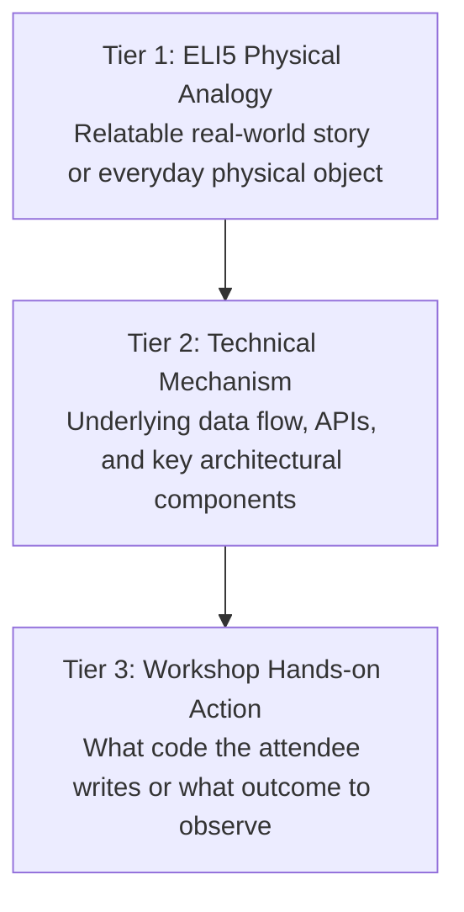
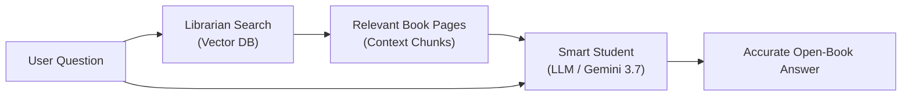

# ELI5 Concept Explainer Skill

## Purpose

Automates the generation of intuitive, jargon-free technical explanations and real-world analogies for complex AI concepts, model architectures, and runtime error signatures. Tailored for workshop facilitators, speakers, and teaching assistants (TAs) to onboard diverse attendee personas (non-coders, junior engineers, product managers, designers) and eliminate cognitive overload during live hands-on labs.

---

## 3-Tier Progressive Disclosure Framework

When explaining any technical concept, the skill enforces a 3-tier progressive explanation structure:

1. **Tier 1 (ELI5 Analogy)**: Strips away mathematical notation and technical acronyms, grounding the idea in a tangible physical analogy.
2. **Tier 2 (Underlying Mechanism)**: Explains what happens behind the scenes (tokens, vectors, memory, network calls) in clear, accessible language.
3. **Tier 3 (Hands-on Action)**: Connects the concept directly to the code snippet or CLI command the attendee executes in the lab.

---

## Master Technical Concept Analogy Matrix

| Technical Concept | Technical Jargon Definition | ELI5 Real-World Analogy | Lab Hands-on Takeaway |
|---|---|---|---|
| **Local LLM Inference** | Running quantized model weights entirely on on-device GPU/NPU/CPU without cloud API calls | Having a skilled encyclopedia reader living inside your laptop who works with no internet connection | Your code queries `localhost:11434` instead of sending data over the internet |
| **Model Quantization (`Q4_K_M`)** | Reducing numerical precision of weight matrices from 16-bit float to 4-bit integers to shrink RAM footprint | Compressing a high-resolution 4K photo into a lightweight JPEG so it fits on a small flash drive while still looking sharp | Lets an 8GB RAM laptop run a 9B model without running out of memory (OOM) |
| **Vector Embeddings** | High-dimensional numerical representations of semantic relationships in latent vector space | Giving every concept a GPS coordinate on a giant conceptual map where 'king' and 'queen' are right next to each other | Translates sentences into arrays of numbers so the computer can measure similarity |
| **RAG (Retrieval-Augmented Generation)** | Querying vector databases for k-NN chunks and injecting them into prompt context windows | An open-book exam where the student checks the reference textbook before writing their answer | Attaches relevant documents to the prompt so the model never hallucinates facts |
| **Function Calling / Tool Use** | LLM generating structured JSON arguments mapped to external API signatures | Giving an assistant a calculator and calendar, letting them push buttons when they need accurate numbers | Model returns a JSON object telling your Python/TS app which function to execute |
| **Multi-Agent Coordinator** | Graph-based orchestrator delegating sub-tasks to specialized sub-agents with state machines | An orchestra conductor directing the violinist and drummer, making sure everyone plays in harmony | Root agent breaks a large user request into smaller tasks for worker agents |
| **Gemini Live & VAD** | Bidirectional 16kHz PCM streaming over WebSockets with Voice Activity Detection | A real-time phone call where the other person pauses when you start speaking and responds when you stop | Continuous voice interaction without clicking a 'Send' button |
| **Human-in-the-Loop (HITL)** | Pausing execution graph at mutation checkpoints awaiting user confirmation | A pilot asking the captain for final takeoff confirmation before throttling the engines | Agent pauses before running critical commands and waits for your terminal approval |

---

## Visual Concept Mental Map Pattern

The skill generates clean Mermaid diagrams to illustrate abstract data flows:

### Example: RAG Open-Book Exam Mental Map

---

## Facilitator & TA 10-Second Crisis Scripting

When an attendee is confused or frustrated during live labs, TAs reference instant 10-second verbal scripts generated by this skill:

### Scenario 1: Attendee asks *"Why did my laptop freeze when loading the model?"*
* **TA Response**: *"Think of your laptop's RAM like a small dinner table. The model is a 10-course banquet. Because the table was full, it overflowed onto the floor. We will switch to a lightweight 4-bit quantized model (`gemma4:e2b`) that fits easily on the table."*

### Scenario 2: Attendee asks *"What is the difference between an API and an Agent?"*
* **TA Response**: *"An API is like a vending machine: you press a button, and you get one snack. An Agent is like a personal chef: you tell them 'make me a healthy dinner', and they plan the recipe, check the fridge, chop the vegetables, and cook the meal on their own."*

---

## Output Artifacts & Integration

When triggered, this skill generates the following deliverables:
1. **`docs/eli5-concept-cheat-sheet.md`**: Complete 3-tier beginner concept guide for attendees.
2. **Slide Analogy Cards**: Callout boxes for `slides.md` and Web HTML presentations.
3. **Facilitator Cue Cards**: Quick analogy reminders embedded in `RUNBOOK.md`.

---

## References

- **Google AI Conceptual Guides**: [https://ai.google.dev/gemini-api/docs](https://ai.google.dev/gemini-api/docs)
- **AGENTS.md Open Specification**: [https://agents.md/](https://agents.md/)
- **Workshop Harness Repository**: [https://github.com/JAICHANGPARK/workshop-harness](https://github.com/JAICHANGPARK/workshop-harness)
