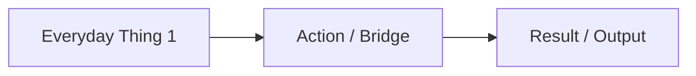

# ELI5 (Explain Like I'm 5) Skill

> Based on the Claude Code Community Plugin specification (`eli5@claude-community`).

## Purpose

Explains complex technical topics, code modules, design trade-offs, and runtime errors in dead-simple terms as if explaining to a 5-year-old child. Focuses on **intuitive real-world analogies, visual diagrams, and minimal text** rather than dense jargon.

---

## Core Rules

1. **Big Pictures & Visuals First**:
   - Always illustrate the explanation with clean diagrams (Mermaid flowcharts/mindmaps or visual artifacts).
   - Use visual components (boxes, arrows, illustrations) rather than long paragraphs of text.

2. **No Technical Jargon**:
   - Strip away math formulas, acronyms, and low-level implementation details.
   - Ground every concept in a physical, everyday object (e.g. toy box, library, kitchen, telephone, mail carrier).

3. **Very Few Words**:
   - Keep sentences short, conversational, and direct.
   - Avoid walls of text. Use bullet points and callouts.

4. **Preserve the Core Mechanism**:
   - Simplicity must never sacrifice accuracy. The explanation must correctly represent the fundamental cause-and-effect relationship under the hood.

---

## Output Structure

When the user asks to explain a concept or runs `/eli5 <topic>`:

### 1. The 1-Sentence Analogy
A single sentence comparing the concept to something from daily life.

### 2. The Visual Picture (Mermaid Diagram)
A simple, colorful flowchart showing how the parts interact.

### 3. Step-by-Step Story (3 Simple Steps)
- **Step 1**: Where it starts (e.g. "You ask for a toy").
- **Step 2**: What happens behind the scenes (e.g. "The helper robot goes to the closet").
- **Step 3**: What you get back (e.g. "The robot hands you the toy").

### 4. What this means in your code / system
A brief 1-2 sentence bridge connecting the analogy back to the user's actual project or terminal error.
