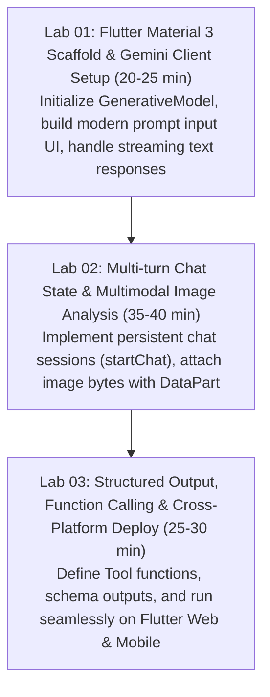

# Flutter Hands-on Workshop Builder Skill

## Purpose

Automates the end-to-end creation of technical hands-on workshops focused on **Flutter Generative AI** cross-platform applications. Enforces clean architecture, **Material 3 UI design**, state management best practices, and the official **`google_generative_ai`** Dart SDK. Provides structured fallback paths including **Flutter Web (`flutter run -d chrome`)** so attendees on any laptop OS can participate without heavy emulator setups.

> Pre-Flight Web Research Protocol:
> Before generating Flutter workshop materials or code, verify the latest versions on `pub.dev` for `google_generative_ai` and check Flutter channel compatibility.

---

## Technical Stack & Dependency Matrix

| Layer | Component | Recommended Package / Version | File Location |
|---|---|---|---|
| **Framework & Language** | Flutter & Dart | Flutter 3.24+ / Dart 3.5+ | `pubspec.yaml` |
| **GenAI SDK** | Google Generative AI Dart | `google_generative_ai: ^0.4.6` | `pubspec.yaml` |
| **Design System** | Flutter Material 3 | `useMaterial3: true` | `lib/main.dart` |
| **Image & Multimodal** | Image Picker | `image_picker: ^1.1.2` | `pubspec.yaml` |
| **Environment Variables** | Flutter Dotenv | `flutter_dotenv: ^5.2.1` | `pubspec.yaml` |

---

## 3-Stage Hands-on Lab Curriculum



---

## Architectural Patterns for Flutter Workshops

### 1. Generative AI Service & Stream Handling

```dart
// Flutter Generative AI Service Example
import 'dart:typed_data';
import 'package:google_generative_ai/google_generative_ai.dart';

class GeminiService {
  final GenerativeModel _model;
  ChatSession? _chatSession;

  GeminiService({required String apiKey, String modelName = 'gemini-3.7-flash'})
      : _model = GenerativeModel(
          model: modelName,
          apiKey: apiKey,
          generationConfig: GenerationConfig(
            temperature: 0.7,
            maxOutputTokens: 1024,
          ),
        );

  void initChat() {
    _chatSession = _model.startChat();
  }

  Stream<GenerateContentResponse> sendMessageStream(String prompt) {
    if (_chatSession == null) initChat();
    return _chatSession!.sendMessageStream(Content.text(prompt));
  }

  Future<String> analyzeImage(String prompt, Uint8List imageBytes, String mimeType) async {
    final content = [
      Content.multi([
        TextPart(prompt),
        DataPart(mimeType, imageBytes),
      ]),
    ];
    final response = await _model.generateContent(content);
    return response.text ?? 'No response';
  }
}
```

---

## Cross-Platform Workshop Strategy & Friction Reducers

Workshops often run into venue WiFi bottlenecks or laptop emulator performance issues. Follow these rules when organizing a Flutter hands-on:

1. **Default Target: Flutter Web (`flutter run -d chrome`)**:
   - Zero emulator installation required.
   - Works uniformly across Windows, macOS, Linux, and ChromeOS.
   - Allows instant browser preview and rapid hot restart.
2. **Mobile Target: Physical Device USB Debugging**:
   - For Android: Enable Developer Options and USB Debugging.
   - For iOS: Requires macOS and Xcode signing certificate.
3. **API Key Handling**:
   - Pass keys via `--dart-define=GEMINI_API_KEY=your_key` during `flutter run` to avoid hardcoding secrets.

---

## Facilitator Verification Checklist

1. Run `flutter doctor -v` to ensure Flutter SDK and Dart toolchain are healthy.
2. Run `flutter create --org com.example workshop_starter` to verify template creation.
3. Execute `flutter test` to ensure unit and widget test suites pass before distributing materials.
