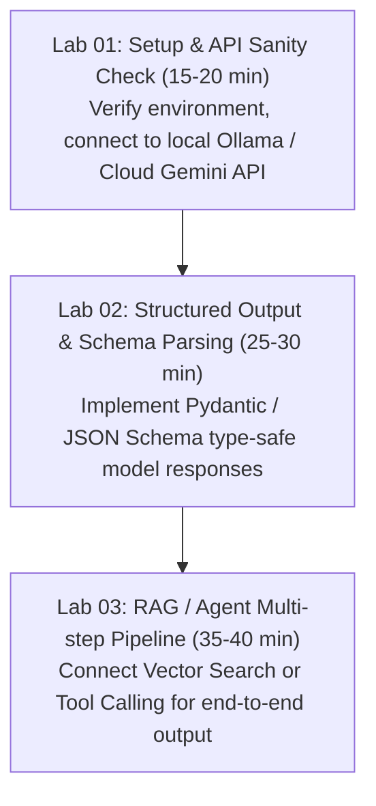
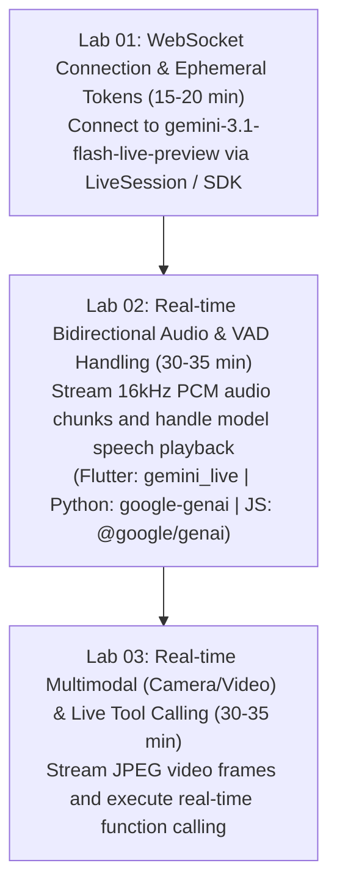

# Hands-on Curriculum Builder Skill

## Purpose
Modularizes workshop content into sequential, timed hands-on labs (60 to 120 minutes total). Enforces a clean separation between starter scaffolding (`01_starter`), reference solutions (`02_final`), step-by-step lab guides (`03_labs/README.md`), and structured prompt engineering packs (`prompt-pack/README.md`).

> 🌐 **Mandatory Pre-Flight Web Research Protocol**:
> Before generating any lab code or instructions, the agent **MUST** perform live web searches (`search_web` / `workshop-web-researcher`) to verify the latest SDK syntax (e.g. `google-genai` SDK vs legacy `google-generativeai`, current LangChain/Ollama versions, latest model tags) and ensure zero deprecated code.

---

## Lab Architecture & Timing Rules

A standard technical workshop curriculum is divided into 3 progressive lab phases:

### Standard LLM / RAG Track


### Gemini Live Real-time Streaming & Multimodal Track (Python / JS / Flutter)


---

## Starter vs Final Code Separation Guidelines

### 1. `workshop/01_starter/`
- Contains complete project configuration files (`pyproject.toml`, `requirements.txt`, `.env.sample`).
- Contains functional entry points (`main.py` / `index.js` / `main.go`) with clearly marked exercise blocks.
- **Exercise Marker Protocol**:
  ```python
  # =========================================================================
  # TODO: [Lab 02 - Exercise] Implement Structured Output Parser
  # Hint: Use Pydantic BaseModel or Gemini response_schema parameter
  # =========================================================================
  def parse_response(raw_text: str):
      # Pass or placeholder implementation for attendees to complete
      raise NotImplementedError("Lab 02 exercise not yet completed!")
  ```

### 2. `workshop/02_final/`
- Contains 100% completed, verified reference implementation.
- All `TODO:` blocks are fully solved, formatted, and tested.
- Must execute cleanly out-of-the-box via `uv run python main.py` or `./run.sh`.

---

## Prompt Pack & Schema Specifications (`prompt-pack/README.md`)

When generating prompt packs for LLM/RAG workshops:
1. Include explicit System Prompts with role definitions and output formatting rules.
2. Provide JSON Schema / Pydantic models for structured output testing.
3. Provide example inputs and expected model output pairs for attendee verification.

---

## Mandatory References Protocol

Every generated lab document, guide, or README **must include a `## References` section** at the bottom listing authoritative sources:

```markdown
## References

- **Official API Documentation**: [Google Gemini API Docs](https://ai.google.dev/docs)
- **Ollama API Specification**: [Ollama GitHub Documentation](https://github.com/ollama/ollama/tree/main/docs)
- **Astral uv Package Manager**: [Astral uv Docs](https://docs.astral.sh/uv/)
- **Workshop Repository**: [Build with AI Harness](https://github.com/JAICHANGPARK/workshop-harness)
```
